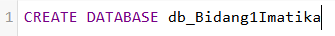
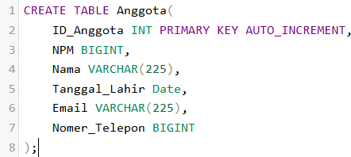
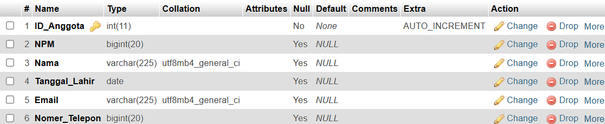

TUGAS AKHIR BASIS DATA (G)

# Step by Step
### Step 1: Membuat database db_Bidang1Imatika (`db_Bidang1Imatika`)
```sql
CREATE DATABASE db_Bidang1Imatika
```


### Step 1: Membuat table Anggota (`Anggota`)
```sql
CREATE TABLE Anggota(
	ID_Anggota INT PRIMARY KEY AUTO_INCREMENT,
	NPM BIGINT,
	Nama VARCHAR(225),
	Tanggal_Lahir Date,
	Email VARCHAR(225),
	Nomer_Telepon BIGINT
);
```


